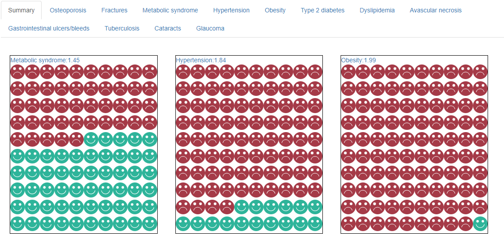

```{r setup, include=FALSE}
knitr::opts_chunk$set(echo = TRUE)

library(OCSRiskCalculator)
library(knitr)
evidence <- OCSRiskCalculator:::evidence
```


## Update from the last meeting
According to the agreement made in the previous meeting, the focus will be on displaying the relative risk associated with each outcome as reported in [Sullivan et al](http://dx.doi.org/10.1016/j.jaci.2017.04.009). As such, we will no longer model background risk.


## Background
The purpose of this project is to create a Web App for quantifying the relative risk of long-term oral corticosteroid (OCS) use in patients with asthma. This will require two steps of

1. Identifying relevant adverse events

2. Estimating the relative effect (risk ratio, hazard ratio, or odds ratio) of using OCS.

We will also model the dose-response association which will capture the relationship between intensity of use, history of use, and risk of outcomes.

Based on a careful review of the literature, the two most important paper appear to be [Efraij et al](https://doi.org/10.1080/02770903.2018.1539100) and [Sullivan et al](http://dx.doi.org/10.1016/j.jaci.2017.04.009). Efraid et al's has the advantage that it is a systematic review. However, most results are based on only two studies. The paper by Sullivan, on the other hand, is a rigorous retrospective cohort study with a large sample size from the US.

Per initial agreements, results are to be kept for a general case, and if evidence allows, stratified by sex and age. Exposure will be defined based on current and historical OCS use.


## Exposure to OCS
The way this variable is defined is dictated by the empirical studies investigating its association with outcomes. The main paper underlying this project by Sullivan et al, uses the current classification:
  
Current OCS dose:
  - Low dose: 1-3 prescriptions per year 
  - High dose: >3 prescriptions per year
  
OCS use history:
  - Number of years with low-dose exposure (1-3 prescriptions / y)
  - Number of years with high-dose exposure (> prescriptions / y)
  
To make this simple, I suggest that we classify the exposure as following three questions:

1) Currently taking OCS:
 No / Yes
 
2) Number of years taking OCS
 [numerical input]
 
3) Historical OCS use intensity
  Low dose / high dose

## Adverse events

Per agreements made in the previous meeting, we will model all the outcomes associated with OCS in the study by Sullivan et al. These include `r names(OCSRiskCalculator::get_outcomes())`.


## Evidence synthesis and statistical analysis

The point estimate of the relative risk for each outcome is provided below

```{r echo=FALSE}
outcomes <- get_outcomes()
x <- t(as.data.frame(get_evidence()))
y <- rownames(x)
items <-  unlist(lapply(y,function(x){substring(x,nchar(x)-2)}))

rownames(x) <- names(outcomes)[match(items,outcomes)]

x <- round(exp(x),digits = 3)

kable(x)

```

### Note: Some point estimates are <1, for example, for metabolic syndrom. It is suggested that such outcomes be removed from the analysis.

### Question: Should this web app also communicate uncertainty? One challenge with reporting uncertainty is that we do not have access to the covariance matrix of the regression coefficients and therefore the uncertainty around predicted relative risk will be at best a rough approximate.

As the scale of interest for risk equations is the relative risk, we will use the above risk ratios (potentially with a measure of uncertainty such as 95%)


## Web app
An interactive web app will be developed and made publicly available. A proposed snapshot of the app is provided below.



# End of document


