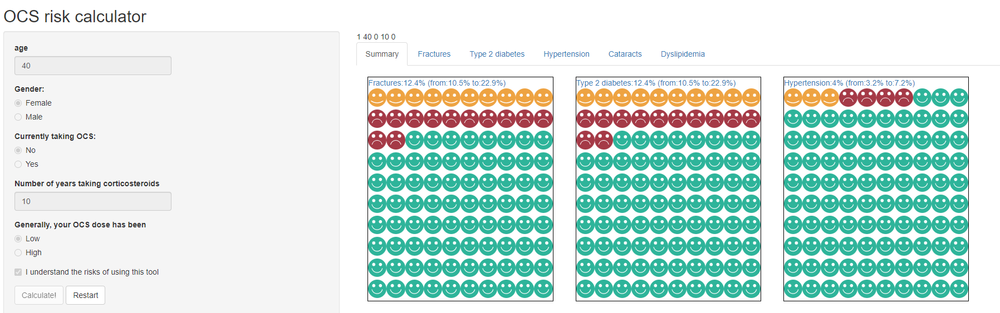

```{r setup, include=FALSE}
knitr::opts_chunk$set(echo = TRUE)

library(OCSRiskCalculator)
evidence <- OCSRiskCalculator:::evidence
```

## Background
The purpose of this project is to create a Web App for quantifying the risk of long-term oral coticosteroid (OCS) use in patients with asthma. This will require two steps of

1. Identifying relevant adverse events

2. Estimating the baseline risk (in the absence of OCS use)

3. Estimating the relative effect (risk ratio, hazard ratio, or odds ratio) of using OCS.

Because evidence on background risk comes from different jurisdications, a clear focus on the target population is important. This report ficuses mainly on studies from the US.

Based on a careful review of the literature, the two most important paper appear to be [Efraij et al](https://doi.org/10.1080/02770903.2018.1539100) and [Sullivan et al](http://dx.doi.org/10.1016/j.jaci.2017.04.009). Efraid et al's has the advantage that it is a systematic review. However, most results are based on only two studies. The paper by Sullivan, on the other hand, is a rigorous retrospective cohort study with a large sample size from the US.

Per initial agreements, results are to be kept for a general case, stratified by sex and age. Exposure will be defined based on current and historical OCS use.

## Rrisk quantification and communication
There are two fundamental ways that the OCS risk can be quantified and communicated

1. Given a history of OCS use, what is the excess risk of a given outcome for a person of given sex and age?

2. Given a history of OCS use, and a plan for future use, what is the 10-year risk of a given outcome for a person of given sex and age?

I strongly suggest the first question for two reasons. First, it does not make any presumption about whether the use already has the condition or not. For example, it will say that a person who has been using OCS at high dose for the past 7 years has now 12% higher chance of having Typ2 Diabetes compared to a similar person from the general population. On the other hand, #2 actually requires for the patient not to have diabetes right now. The evidence base reported in the literature does not really support this type of conditional risk estimation, and stronger assumptions can be made about #2.


## Exposure to OCS
The way this variable is defined is dictated by the empirical studies investigating its association with outcomes. The main paper underlying this project by Sullivan et al, uses the current classification:
  
Current OCS dose:
  - Low dose: 1-3 prescriptions per year 
  - High dose: >3 prescriptions per year
OCS use history:
  - Number of years with low-dose exposure (1-3 prescriptions / y)
  - Number of years with high-dose exposure (> prescriptions / y)
  
To make this simple, I suggest that we classify the exposure as following three questions:

1) Currently taking OCS:
 No / Yes
 
2) Number of years taking corticosteroids
 [numerical input]
 
3) Historical OCS use intensity
  Low dose / high dose

## Adverse events
Upon reviewing the literature, the following adverse events are being modeled: 

* Osteoporosis fractures
* Diabetes
* Cataract
* Hypertension
* Dyslipidemia

These are chosen because the excess risk due to OCS is nontrivial, and there is relatively robust evidence for estimating background risk by age and sex.

## Evidence synthesis and statistical analysis

The scale of interest for risk equations is the absolute risk, whereas the scale of inference (in both Efraij and Sullivan et al) is the relative scale (hazard ratio or rate ratios). Transforming the relative risk to absolute risk will require estimating the baseline incidence of each outcome. For background risk, I will synthesize evidence from general cohort studies and population-based estimates, with an emphasis on US studies. This assumes that the risk is the same between general population and asthma patients not exposed to OCS.This assumption seems to be safe as there is no strong association between asthma and identified outcome conditions.

The structure of the final risk equations will have the form

Log-odds(risk)=β0 + β1.X1 + β2.X2 + β3*X3 + ...

where X1, X2, X3, ... are gender, age, and OCS-exposure variables. The structure of the above-mentioned equation will be modified depending on the nuances of the available evidence.

## Web app
An interactive web app will be developed and made publicly available. A proposed snapshot of the app is provided below.



# End of document


